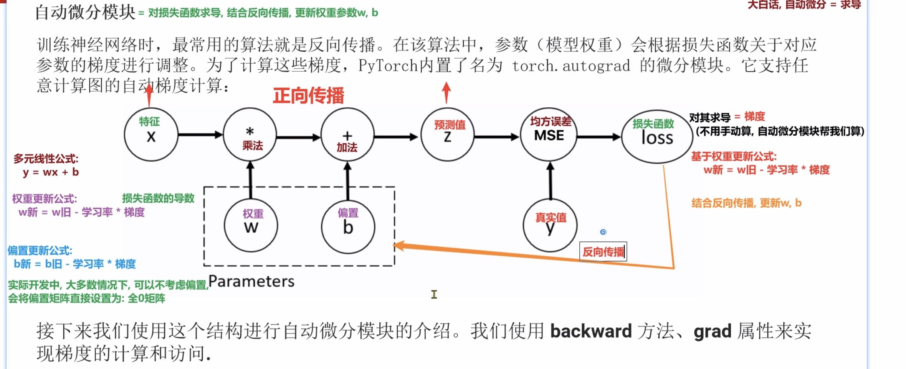

# 自动微分 autograd 入门：正向传播、反向传播与梯度下降

> 整理日期：2026-08-01 18:24
> 关联书籍：《PyTorch 深度学习实战》

## 一张图看懂训练全流程



**大白话：自动微分 = 求导。** 训练神经网络最常用的算法是**反向传播**——参数（权重 w、偏置 b）根据「损失函数对它的梯度」来调整。PyTorch 内置了 `torch.autograd` 模块，能对任意计算图**自动求梯度**，省去人工推导链式法则的苦。

## 本轮学到的核心知识

- **一次训练 = 正向传播 + 反向传播 两个方向**

- **① 正向传播（图中黑色箭头，从左往右）：把数据算成预测和误差**

  ```
  特征X ──×权重w──→ ──+偏置b──→ 预测值Z ──与真实值y比──→ MSE ──→ loss
  ```

  | 节点 | 含义 |
  |------|------|
  | 特征 X | 输入数据（喂给模型的原料） |
  | × 权重 w / + 偏置 b | 线性运算，公式 `Z = w·X + b`（多元线性公式 `y = wx + b`） |
  | 预测值 Z | 模型的输出 |
  | 真实值 y | 标准答案（数据的真实标签） |
  | MSE 均方误差 | 把「预测 Z」和「答案 y」的差距量化 |
  | loss 损失函数 | 一个数字，**越小说明预测越准** |

- **② Parameters：只有 w、b 能被训练**
  - 图中虚线框圈住 `w`、`b`，标为 `Parameters`。X 和 y 是死数据不能动，**训练的本质就是不停微调 w、b 让 loss 变小**。
  - 实用提醒：实际开发中很多情况**可以先不考虑偏置**，把偏置矩阵直接设为全 0，先抓主要矛盾 w。

- **③ 反向传播（图中橙色箭头，从 loss 倒回 w、b）：算梯度、更新参数**
  - **对 loss 求导 = 梯度**：梯度 = 「loss 对某参数的敏感度 + 该往哪调」。**不用手动算，autograd 帮我们算。**
  - **梯度下降更新公式**：
    ```
    w新 = w旧 - 学习率 × 梯度
    b新 = b旧 - 学习率 × 梯度
    ```
  - 为什么是**减**梯度？梯度指向「loss 上升最快」的方向，往反方向走才能让 loss 下降。
  - **学习率**控制每步迈多大：太大易震荡、迈过头；太小学得慢。

- **④ autograd 帮你省的就是「求梯度」这步**
  - 你只管搭好正向传播，autograd 自动记录每一步；一句 `loss.backward()` 就把所有参数的梯度全算好。
  - 用 `参数.grad` 属性即可访问算出来的梯度。

## 我踩过的坑 / 薄弱项

- **误解「减去梯度」**：一开始不理解为什么更新是「旧值减梯度」。记牢：梯度指向 loss **上升**方向，要让 loss 下降就得往**反方向**走，所以是减。
- **要算梯度的张量必须 `requires_grad=True`**：普通张量默认不追踪梯度，`.backward()` 后 `.grad` 是 `None`。参数创建时要写 `requires_grad=True`。
- **梯度会「累加」，用完必须清零**：PyTorch 默认把每次 `backward()` 的梯度**加**到 `.grad` 上（不是覆盖）。所以每轮更新完要 `参数.grad.zero_()`，否则梯度越滚越大、训练崩掉。
- **参数必须是浮点型**：`requires_grad=True` 只能给浮点张量；整数张量不能求梯度（回顾 [张量数据类型判断（dtype 与小数点）](../20260731/张量数据类型判断-dtype与小数点-1925.md)）。
- **更新参数时要 `torch.no_grad()`**：手动改参数值的那几行别再被 autograd 记进计算图，用 `with torch.no_grad():` 包起来。

## 可运行的代码示例

```python
import torch

# 1) 造参数：requires_grad=True 表示“要被训练、要算梯度”（且必须是浮点）
w = torch.tensor(2.0, requires_grad=True)
b = torch.tensor(0.0, requires_grad=True)

x = torch.tensor(3.0)      # 特征（数据，不需要梯度）
y = torch.tensor(10.0)     # 真实值（答案）

# 2) 正向传播：照着图从左往右算
z = w * x + b              # 预测值 Z = wx + b  → 6.0
loss = (z - y) ** 2        # 均方误差 MSE（单样本）→ (6-10)^2 = 16
print('预测 z =', z.item(), ' loss =', loss.item())

# 3) 反向传播：一句话把梯度全算好（autograd 自动求导）
loss.backward()

# 4) 用 .grad 访问梯度（图里的“对 loss 求导 = 梯度”）
print('w.grad =', w.grad)   # dloss/dw = 2*(z-y)*x = 2*(-4)*3 = -24
print('b.grad =', b.grad)   # dloss/db = 2*(z-y)   = 2*(-4)   = -8

# 5) 梯度下降走一步：w新 = w旧 - 学习率*梯度
lr = 0.01
with torch.no_grad():          # 更新参数时不要再记录计算图
    w -= lr * w.grad
    b -= lr * b.grad
    w.grad.zero_()             # 梯度会累加，用完清零
    b.grad.zero_()

print('更新后 w =', w.item(), ' b =', b.item())

# —— 把 2~5 步放进 for 循环重复上千次，loss 就会一路降下来，模型就“学会”了 ——
```

## 延伸提示

- 这套 `forward → loss → backward → 更新参数` 是**所有深度学习训练的通用骨架**，可对照 [torch 库的构成与训练流程](../20260724/torch库的构成与训练流程-2214.md) 一起看；「训练 / 预训练 / 推理」的区别见 [训练/预训练/推理三个概念](../20260726/训练-预训练-推理三个概念-1535.md)。
- 后续会用 `optimizer`（如 SGD、Adam）把「第 5 步手动更新 + 清零」自动化，写成 `optimizer.step()` 和 `optimizer.zero_grad()`，逻辑和本篇手写的完全一样，只是更省事。
- **与研究任务的联系**：以后做 **NPSLE 的 MRI 诊断模型**，不管骨干网络换成 CNN、Transformer 还是 GCN，训练时都是这同一套流程；区别只是中间计算图从一句 `wx+b` 换成几百万参数的深层网络，但 autograd 依然一句 `loss.backward()` 全帮你搞定——这正是 PyTorch 好用的核心。
