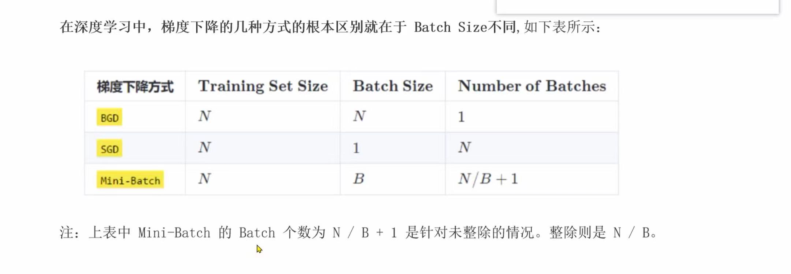

# 梯度下降的三种方式：BGD / SGD / Mini-Batch

> 整理日期：2026-08-04 20:53
> 关联书籍：《PyTorch 深度学习实战》

## 本轮学到的核心知识

本轮看的这张表在讲**梯度下降的三种方式**，它们的**根本区别只有一个**：每次更新一次模型参数时，喂进去多少个样本（也就是 **Batch Size**）。



**先搞懂三个术语：**

- **N（Training Set Size）**：训练集里一共有多少个样本。比如 1000 张图片，N = 1000。
- **Batch Size**：每次拿多少个样本去算梯度、更新**一次**参数。
- **Number of Batches**：一整轮（一个 epoch）里参数会被更新几次。

**关键公式：**
> **批次数 = 总样本数 ÷ 每批样本数 = N ÷ Batch Size**

**三种方式对比（假设 N = 1000）：**

| 方式 | Batch Size（每批几个） | 批次数（一轮更新几次） | 通俗理解 |
|------|------------------------|------------------------|----------|
| **BGD** 批量梯度下降 | `N` = 1000（全部） | `1` | 全部样本算完才更新 **1 次** |
| **SGD** 随机梯度下降 | `1`（一个） | `N` = 1000 | 每 **1 个**样本就更新一次 |
| **Mini-Batch** 小批量 | `B`（如 100） | `N/B`（如 10） | 每 **B 个**一批，更新 N/B 次 |

规律：**Batch Size 越小，一轮里更新次数越多**（两者相乘恒等于 N）。

**三种方式的取舍：**

- **BGD（全部一起）**：方向最准，但一轮才更新 1 次，**太慢**；数据一多，内存也放不下。
- **SGD（一次一个）**：更新飞快，但每次只看 1 个样本，方向**抖动大、不稳定**。
- **Mini-Batch（折中）**：每次用一小批（常见 32 / 64 / 128），**又比较稳、又比较快**，所以**实际训练几乎都用它**。

## 我踩过的坑 / 薄弱项

- **坑：不理解表里 Mini-Batch 的批次数为什么是 `N / B + 1`。**
  - 那个 `+1` 是**针对不能整除的情况**，用来装下「除不尽剩下的零头」。
  - N = 1000，B = 100 → 正好 10 批（整除），批次数 = `N/B` = 10。
  - N = 1050，B = 100 → 先分 10 批，还剩 50 个，这 50 个再单独凑成 1 批 → 共 **11** 批，即 `N/B + 1`。
  - 一句话：**能整除就是 `N/B`，除不尽就 `N/B + 1`**。
- **薄弱项**：一开始容易把「Batch Size（每批几个）」和「Number of Batches（分成几批）」搞混。记住它俩是**相乘等于 N** 的关系，就不会反。

## 可运行的代码示例

```python
import torch
from torch.utils.data import TensorDataset, DataLoader

# 造一份假数据：1000 个样本，每个样本 5 个特征
N = 1000
X = torch.randn(N, 5)
y = torch.randint(0, 2, (N,))   # 二分类标签
dataset = TensorDataset(X, y)

# ---- 用 DataLoader 的 batch_size 控制“每批几个” ----
for B in [N, 1, 100]:          # 分别对应 BGD / SGD / Mini-Batch
    loader = DataLoader(dataset, batch_size=B, shuffle=True)
    num_batches = len(loader)  # 一轮里会更新多少次参数
    name = {N: "BGD(整批)", 1: "SGD(单样本)", 100: "Mini-Batch(B=100)"}[B]
    print(f"{name:20s} batch_size={B:<5d} 一轮更新 {num_batches} 次")

# 输出（约）：
# BGD(整批)            batch_size=1000  一轮更新 1 次
# SGD(单样本)          batch_size=1     一轮更新 1000 次
# Mini-Batch(B=100)    batch_size=100   一轮更新 10 次

# ---- 实际训练里，一个 epoch 就是遍历一遍所有 batch ----
loader = DataLoader(dataset, batch_size=100, shuffle=True)
for batch_X, batch_y in loader:
    # 每个 batch 在这里算一次损失、反向传播、更新一次参数
    # loss = ...; loss.backward(); optimizer.step()
    print("这一批的形状：", batch_X.shape)   # [100, 5]
    break   # 只演示第一批
```

## 延伸提示

- **和研究任务的关联**：NPSLE 这类医学影像数据通常**样本少**，训练时几乎一定用 **Mini-Batch**（如 batch_size=8/16），既能稳定训练、又能配合数据增强。理解 batch 概念是后面搭训练循环的前提。
- **配套概念**：梯度下降依赖 autograd 自动算梯度，可回顾 [自动微分 autograd 入门（正向/反向传播与梯度下降）](../20260801/自动微分autograd入门-正向反向传播与梯度下降-1824.md)；batch 维度怎么在张量里表示见 [批次维度与多图处理（unsqueeze/stack/cat）](../20260726/批次维度与多图处理-unsqueeze-stack-cat-1535.md)。
- **下一步**：书中后面会用 `DataLoader` 搭真实训练循环，届时可留意 `batch_size` 取不同值时，loss 曲线是「平滑下降」（大 batch）还是「上下抖动」（小 batch）。
