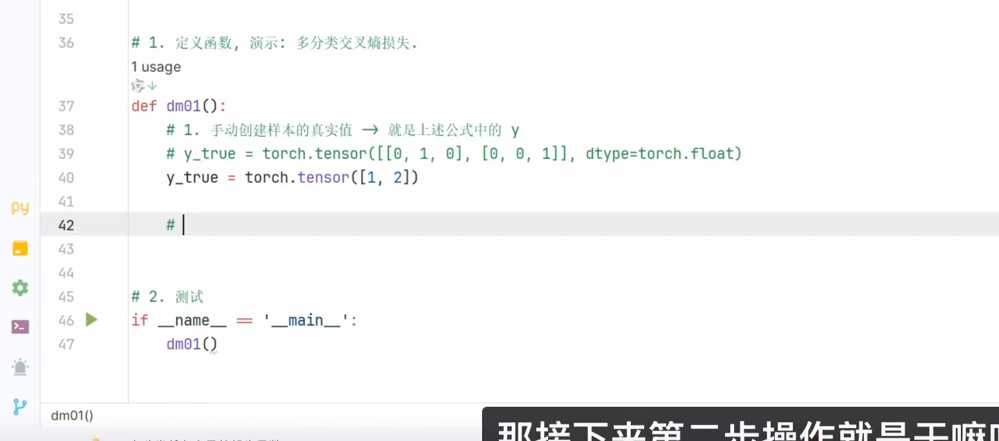

# One-Hot 独热编码 与 类别索引标签

> 整理日期：2026-08-04 20:53
> 关联书籍：《PyTorch 深度学习实战》

## 本轮学到的核心知识

本轮在看「多分类交叉熵损失」的演示代码时，遇到了同一批标签的**两种写法**，核心是搞清它们为什么等价、以及 PyTorch 里到底该用哪种。



- **真实标签（y_true）有两种编码方式**：
  - **One-Hot 独热编码**：每个样本用**一整行**表示，行的长度 = 类别总数。哪个位置是 `1`，就代表属于哪一类，其余全是 `0`。
    例：`[[0, 1, 0], [0, 0, 1]]` —— 2 个样本、3 个类别。
  - **类别索引（整数标签）**：每个样本直接用**一个整数**，表示它属于第几类（**从 0 开始数**）。
    例：`[1, 2]` —— 第 1 个样本是第 1 类，第 2 个样本是第 2 类。

- **两者的换算规则（一句话记住）**：
  > **索引标签 = One-Hot 里那个 `1` 所在的下标（下标从 0 开始）**

  | One-Hot | `1` 在第几号位置 | 索引标签 |
  |---------|------------------|----------|
  | `[1, 0, 0]` | 第 0 号 | `0` |
  | `[0, 1, 0]` | 第 1 号 | `1` |
  | `[0, 0, 1]` | 第 2 号 | `2` |

  所以 `[[0, 1, 0], [0, 0, 1]]` 等价于 `[1, 2]`。

- **PyTorch 里用哪种？** —— `nn.CrossEntropyLoss`（多分类交叉熵）**要求真实标签用「类别索引」格式**，不用手写 One-Hot。你把 `[1, 2]` 直接传进去即可，PyTorch 内部会自动完成「索引 → 对应类别」的计算。这就是为什么代码里 One-Hot 那行被注释掉、实际用的是 `y_true = torch.tensor([1, 2])`。

## 我踩过的坑 / 薄弱项

- **坑：把 `1` 的位置数错了。** 我一度以为 `[[0, 1, 0], [1, 0, 0]]` 等价于 `[1, 2]`，其实不对：
  - `[0, 1, 0]` → `1` 在第 **1** 号位 → 标签 `1` ✅
  - `[1, 0, 0]` → `1` 在第 **0** 号位 → 标签 `0`（不是 2！）
  - 所以它等价的是 `[1, 0]`，不是 `[1, 2]`。
- **根源**：下标是**从 0 开始**数的，不是从 1 开始。`2` 意味着 `1` 要出现在第 2 号位置，也就是 `[0, 0, 1]`。以后换算时，先盯住 `1` 的位置，再从 0 往后数。

## 可运行的代码示例

```python
import torch
import torch.nn as nn

# ---- 1. 同一批标签的两种等价写法 ----
# One-Hot 写法：2 个样本、3 个类别
y_onehot = torch.tensor([[0, 1, 0], [0, 0, 1]], dtype=torch.float)
# 类别索引写法（CrossEntropyLoss 需要的就是这种）
y_true = torch.tensor([1, 2])   # 第1个样本→类别1，第2个样本→类别2

# 用 argmax 验证：One-Hot 里 1 的下标，正好就是索引标签
print("从 One-Hot 还原出的索引：", y_onehot.argmax(dim=1))  # tensor([1, 2])

# ---- 2. 交叉熵损失怎么用 ----
# y_pred 是模型输出的“原始分数(logits)”，形状 = [样本数, 类别数]
# 注意：不要自己先做 softmax，CrossEntropyLoss 内部已经包含了 softmax
y_pred = torch.tensor([[0.1, 2.0, 0.3],    # 第1个样本，3 个类别的打分
                       [0.2, 0.1, 3.0]])   # 第2个样本

loss_fn = nn.CrossEntropyLoss()
loss = loss_fn(y_pred, y_true)   # 真实标签直接传索引 [1, 2] 即可
print("交叉熵损失：", loss.item())
```

## 延伸提示

- **和研究任务的关联**：SLE / NPSLE 智能诊断本质是**分类任务**（如「是否患病」「病灶类型」）。搞清标签编码，是后面用交叉熵训练分类器、看懂网络输出的基础。
- **配套概念**：交叉熵前面通常接 softmax（把分数变成概率），可回顾 [解读网络输出（max 与 softmax）](../20260726/解读网络输出-max与softmax-1535.md)；损失函数与激活函数的搭配关系见 [梯度消失与激活函数、损失函数的关系](../20260803/梯度消失与激活函数损失函数的关系-1332.md)。
- **下一步**：可以试着改动 `y_pred` 的数值，观察当预测越接近真实类别时，交叉熵损失是不是越小，建立「损失 = 预测差多少」的直觉。
